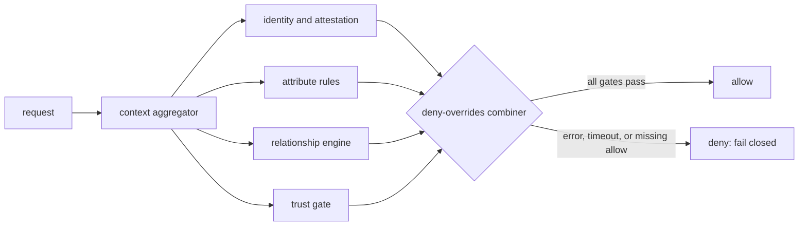
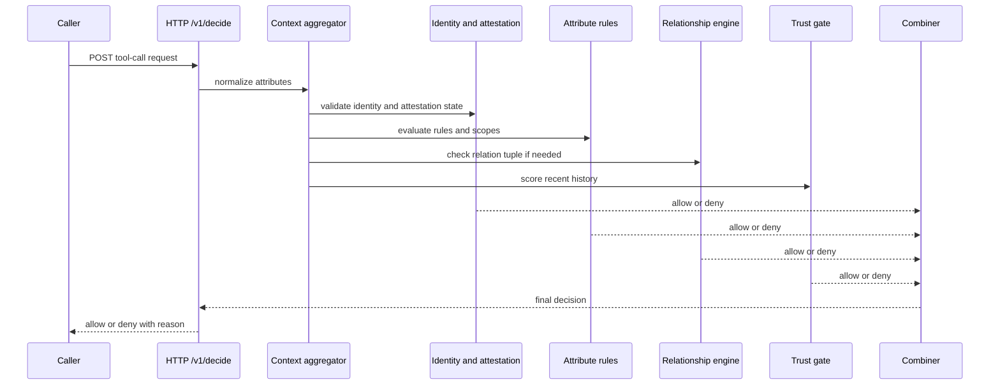

<p align="center"></p>

# Contextual Trust Policy Engine

[](https://github.com/contextual-trust-policy-engine/contextual-trust-policy-engine/actions/workflows/ci.yml)
[](https://github.com/contextual-trust-policy-engine/contextual-trust-policy-engine/actions/workflows/formal.yml)
[](https://github.com/contextual-trust-policy-engine/contextual-trust-policy-engine/actions/workflows/security.yml)

Contextual Trust Policy Engine is a deny-by-default policy decision point (PDP) for automated tool calls. It combines attribute-based access control (ABAC), relationship-based access control (ReBAC), a hybrid trust score, and an Open Policy Agent (OPA) Rego backend.

## Why I built this

I wanted a small policy gate that treats a tool call as an authorization decision, not as a text filtering problem. The gate must fail closed when identity, attestation, context, relationship checks, or trust state are missing or stale.

I also wanted the project to keep failed claims visible. The committed artifacts show where the design works, where it does not, and what changed after removing shortcut rules.

## How it works

The in-process PDP and the Hypertext Transfer Protocol (HTTP) service use the same combiner. Deny decisions override allow decisions. Errors, timeouts, missing rules, or incomplete context return deny. Requests can carry a SPIFFE Verifiable Identity Document (SVID), and the trust model uses an exponentially weighted moving average (EWMA) with Wilson lower bounds.





The OPA policy in `policies/contextual_trust_policy_engine.rego` mirrors the native combiner for integration tests. The Temporal Logic of Actions (TLA+) model checks deny-by-default behavior for the decision state machine.

## Quickstart

Linux and macOS:

```bash
python3.12 -m venv .venv
source .venv/bin/activate
python -m pip install -U pip
python -m pip install -e ".[dev]"
contextual-trust-policy-engine bench --repeats 10
pytest -q
```

Windows PowerShell:

```powershell
py -3.12 -m venv .venv
.\.venv\Scripts\Activate.ps1
python -m pip install -U pip
python -m pip install -e ".[dev]"
contextual-trust-policy-engine bench --repeats 10
pytest -q
```

Run the HTTP service:

```bash
contextual-trust-policy-engine serve --port 18100
```

## What I measured

The reference artifacts are committed under `results/reference-run/`, `results/benchmark-test/`, and `results/benchmark-dev/`. The benchmark row uses `zero-trust-agent-benchmark-dataset-v4.1`, test split sha256 `d065bab9bed145490579cd7add6a574c6e23c21c0ea4525dc1c14b0fc15acd2b`. Rates use Wilson 95% intervals over distinct traces. Latency uses 100 trials on Windows 11 ARM64, Snapdragon X Elite, Python 3.12.

| Claim or metric | Result | Method | Outcome |
|---|---:|---|---|
| Policy decision point p50/p95/p99 at 10k attribute rules <= 3/8/15 ms | 0.111 / 0.290 / 0.319 ms | bootstrap p99 [0.261, 0.349] | Met |
| HTTP service p99 at 10k attribute rules | 2.139 ms | bootstrap [1.566, 2.205] | Inconclusive |
| Relationship check p99 at 1e6 tuples grows within target | 0.001 ms | bootstrap [0.001, 0.019] | Met |
| HTTP relationship p99 at 1e6 tuples | 1.471 ms | bootstrap [1.188, 1.894] | Inconclusive |
| Hybrid trust score beats single methods | hybrid Brier 0.3349; EWMA 0.0955 | 500 dev histories, 2,742 outcomes | Not met |
| Benchmark v4 blocks all attacks with low false-positive rate and zero leaks | block 90.0% (450/500); false-positive rate 0.8% (4/500); leaks 0 | Wilson block [87.1%, 92.3%], false-positive rate [0.3%, 2.0%] | Not met |
| Formal model check | 101,812 distinct states / 471,756 generated | depth 16 | Met |

Benchmark v4 test split:

| Slice | Attack traces | Block rate | Leak count | False-positive rate |
|---|---:|---:|---:|---:|
| Overall | 500 | 90.0% [87.1%, 92.3%] | 0 | 0.8% [0.3%, 2.0%] |
| In-policy attacks | 250 | 82.4% [77.2%, 86.6%] | 0 | n/a |
| Out-of-policy attacks | 250 | 97.6% [94.9%, 98.9%] | 0 | n/a |

Defense ablation on the test split:

| Version | Block rate | False-positive rate | Leak rate | p95 latency |
|---|---:|---:|---:|---:|
| Version 1 | 76.6% [72.7%, 80.1%] | 0.8% [0.3%, 2.0%] | 0.0% [0.0%, 0.4%] | 0.392 ms [0.367, 0.426] |
| + raw-generation frame checks | 80.6% [76.9%, 83.8%] | 0.8% [0.3%, 2.0%] | 0.0% [0.0%, 0.4%] | 0.393 ms [0.363, 0.423] |
| + untrusted content taint checks | 84.8% [81.4%, 87.7%] | 0.8% [0.3%, 2.0%] | 0.0% [0.0%, 0.4%] | 0.656 ms [0.558, 0.836] |
| Final requester-authority checks | 90.0% [87.1%, 92.3%] | 0.8% [0.3%, 2.0%] | 0.0% [0.0%, 0.4%] | 0.528 ms [0.479, 0.596] |

The final benchmark run used the benchmark evaluator with issued secrets provided and again without issued secrets; both runs returned the same rates. The hybrid trust score calibrated worse than EWMA because the dev histories are short. The score stays in the cold-start branch and uses the conservative Wilson lower bound while EWMA reacts faster to benign observations. An earlier benchmark dataset had shortcuts; v4 replaced it and removed those rows from the report.

## Limitations

The PDP is conservative for privileged tools from untrusted context. The OPA policy expects normalized attributes from the caller. The benchmark result improved but still does not meet the all-attacks-blocked target after removing shortcut rules; remaining misses need stronger semantic intent and resource-ownership evidence than the current request shape provides. The ReBAC engine is an in-memory evaluator, not a distributed tuple store.

## License and citation

Apache-2.0. Use `CITATION.cff` for software citation metadata.
